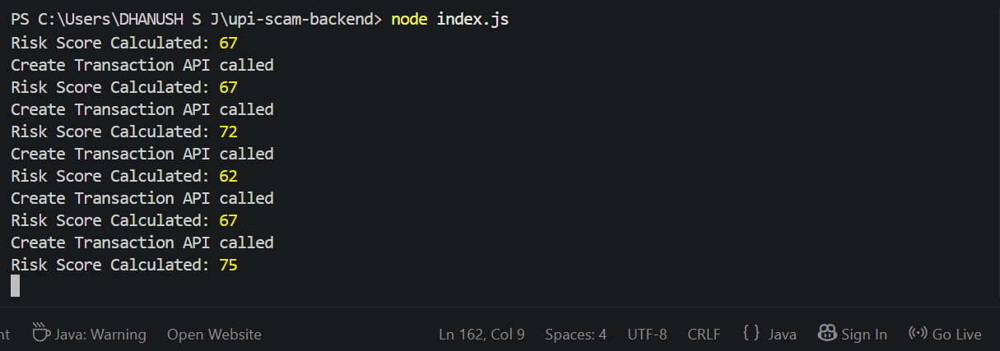
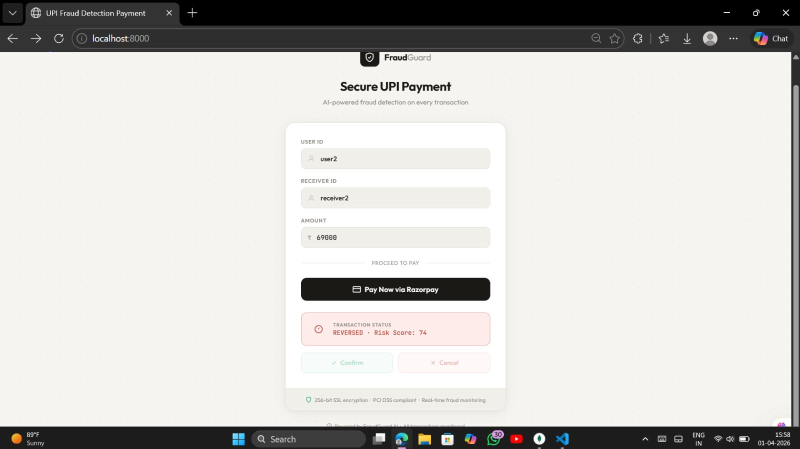
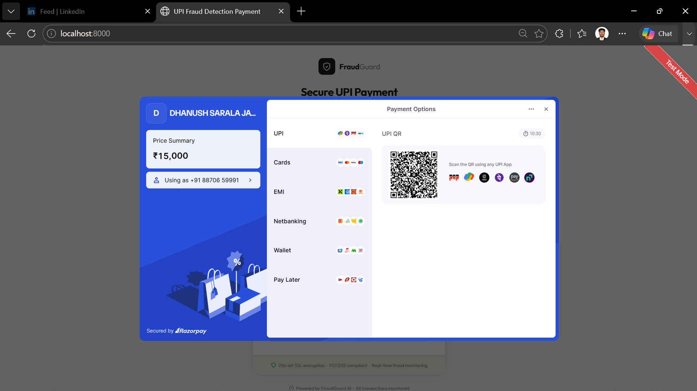

````markdown
# Real-Time UPI Fraud Detection and Soft Hold Payment Security System

## Overview

The **Real-Time UPI Fraud Detection and Soft Hold Payment Security System** is a payment security application designed to identify potentially fraudulent transactions and take preventive action before a suspicious payment is finalized.

The system combines transaction risk scoring, user and receiver profiles, payment processing, a policy engine, soft-hold processing, automatic reversal, fraud alerts, blacklist management, transaction velocity analysis, audit logging, and an administrative analytics dashboard.

The main objective is to provide a **real-time preventive layer** for digital payments, where suspicious transactions can be temporarily held and evaluated before they are allowed to proceed.

---

## Problem Statement

Digital payment systems provide fast and convenient transactions, but the same speed can create difficulties when a user sends money to a fraudulent or suspicious receiver.

A conventional transaction flow can be represented as:

User  
↓  
Payment Initiated  
↓  
Payment Processed  
↓  
Fraud Detected  
↓  
Alert

At this stage, the transaction may already have been completed.

This project introduces an additional security layer:

User  
↓  
Transaction Initiated  
↓  
Risk Analysis  
↓  
Policy Evaluation  
↓  
Low Risk → Complete  
↓  
Medium Risk → Soft Hold  
↓  
High Risk → Reverse

---

## Proposed Solution

The system evaluates transaction-related information and generates a risk score before the payment is finalized.

Based on the risk level, the policy engine takes one of three actions:

| Risk Level | Risk Score | Action |
|---|---:|---|
| Low Risk | 0–59 | COMPLETED |
| Medium Risk | 60–85 | HOLD |
| High Risk | 86–100 | REVERSED |

The thresholds can be configured according to the application's policy.

The soft-hold mechanism provides a temporary safety window for suspicious but not conclusively fraudulent transactions.

---

# Key Features

## 1. Real-Time Risk Scoring

The system calculates a risk score for a transaction using available user, receiver, and transaction information.

Factors considered include:

- Sender trust information
- Previous fraud activity
- Receiver risk information
- Previous hold activity
- Fraud reports
- Transaction amount
- Transaction behaviour
- Transaction velocity

The resulting score is normalized between:

**0–100**

A higher score represents greater transaction risk.

---

## 2. User Behaviour and Trust Information

The system maintains user profile information that contributes to future transaction risk evaluation.

A user's previous transaction behaviour can influence the risk assessment of subsequent transactions.

---

## 3. Receiver Risk Profiling

The system maintains information about payment receivers.

Receiver-related information can include:

- Receiver risk score
- Hold transactions
- Fraud reports
- Suspicious transaction activity

Transactions involving receivers with suspicious histories can therefore receive additional risk consideration.

---

## 4. Transaction Amount Analysis

The transaction amount contributes to risk evaluation.

Large-value transactions can receive additional risk consideration because unusually large payments may represent higher financial exposure.

---

## 5. Transaction Velocity Detection

The system includes transaction velocity analysis to identify unusually frequent transaction activity within a short period.

Example:

Multiple transactions  
↓  
Short time interval  
↓  
Velocity detected  
↓  
Additional risk

---

## 6. Blacklist Management

The system maintains a blacklist for entities identified as suspicious or fraudulent.

A blacklisted receiver can result in increased transaction risk and contribute to preventive action.

---

# Soft Hold Mechanism

The **Soft Hold Mechanism** is one of the main components of the project.

Instead of immediately completing a medium-risk transaction, the system temporarily places the transaction into a `HOLD` state.

Example:

Risk Score = 70  
↓  
Medium Risk  
↓  
HOLD

The user can then:

**Confirm**

HOLD  
↓  
CONFIRM  
↓  
COMPLETED

or:

**Cancel**

HOLD  
↓  
CANCEL  
↓  
REVERSED

This provides an additional opportunity to prevent a suspicious payment from being finalized.

---

# Automatic Hold Expiry

A held transaction should not remain in the `HOLD` state indefinitely.

The hold-expiry process checks transactions whose hold period has expired.

HOLD  
↓  
Hold Period Expires  
↓  
No Confirmation  
↓  
REVERSED

The reversal is recorded in the audit log.

---

# High-Risk Transaction Reversal

Transactions classified as high risk can be moved to the reversed state by the policy engine.

Example:

Risk Score = 92  
↓  
HIGH RISK  
↓  
REVERSED

---

# Fraud Reporting and Receiver Risk

Receiver-related fraud information can be incorporated into future risk assessment.

The intended workflow is:

Transaction  
↓  
Suspicious Activity  
↓  
Fraud Report  
↓  
Receiver Fraud Information  
↓  
Higher Receiver Risk  
↓  
Higher Future Transaction Risk

As suspicious activity accumulates, future transactions involving the receiver can receive additional risk consideration.

---

# Payment Gateway Integration

The system integrates the **Razorpay payment gateway** for payment order creation and payment processing.

Payment Request  
↓  
Backend Transaction Creation  
↓  
Risk Evaluation  
↓  
Razorpay Order  
↓  
Payment Authorization  
↓  
Policy Processing  
↓  
Complete / Hold / Reverse

The Razorpay order and payment information are associated with the corresponding transaction.

---

# Transaction Lifecycle

A transaction can move through different states during processing.

PENDING  
↓  
AUTHORIZED  
↓  
COMPLETED / HOLD / REVERSED

For a held transaction:

HOLD  
↓  
CONFIRM → COMPLETED

or:

HOLD  
↓  
CANCEL → REVERSED

or:

HOLD  
↓  
EXPIRY → REVERSED

---

# Policy Engine

The policy engine determines the action based on the calculated risk score.

```text
if riskScore < 60
    COMPLETED

if riskScore >= 60 && riskScore < 86
    HOLD

if riskScore >= 86
    REVERSED
````

The risk scoring component determines the risk, while the policy engine determines the transaction action.

---

# Alerts

The system contains an alert mechanism for security-related events.

Alerts can be generated for:

* High-risk transactions
* Suspicious activity
* Fraud-related events
* Other security conditions

---

# Audit Logging

Important transaction state changes are recorded through audit logs.

For example:

```text
Previous Status: HOLD
New Status: REVERSED
Actor: system
Action: AUTO_REFUND_HOLD_EXPIRED
```

Audit logging provides a record of important system actions.

---

# Admin Dashboard

The project contains an administrative dashboard for monitoring payment activity.

The dashboard provides information such as:

* Total transactions
* Completed transactions
* Held transactions
* Reversed transactions
* Flagged transactions
* Risk-related activity
* Alerts
* Transaction analytics

---

# Analytics

The analytics module provides transaction statistics including:

* Total Transactions
* Completed Transactions
* HOLD Transactions
* Reversed Transactions
* Flagged Transactions

This information is displayed through dashboard cards and charts.

---

# QR / Scanner Page

The application also includes a scanner/payment-related interface that can be used as part of the payment workflow.

---

# System Architecture

```text
                        ┌──────────────────────┐
                        │      Frontend        │
                        │   HTML / CSS / JS    │
                        └──────────┬───────────┘
                                   │
                                   ↓
                        ┌──────────────────────┐
                        │    Express Server    │
                        └──────────┬───────────┘
                                   │
              ┌────────────────────┼────────────────────┐
              ↓                    ↓                    ↓
       Transaction Routes     Admin Routes       Analytics Routes
              │                    │                    │
              ↓                    ↓                    ↓
       Transaction Controller   Admin Controller   Analytics Controller
              │
              ↓
       ┌──────────────────────┐
       │    Risk Engine       │
       └──────────┬───────────┘
                  ↓
       ┌──────────────────────┐
       │    Policy Engine     │
       └──────────┬───────────┘
                  ↓
       ┌──────────────────────┐
       │    Soft Hold         │
       │    Processing        │
       └──────────┬───────────┘
                  ↓
       ┌──────────────────────┐
       │    MongoDB           │
       └──────────────────────┘
```

---

# Project Structure

```text
upi-scam-backend/
│
├── config/
│   └── razorpay.js
│
├── controllers/
│   ├── adminController.js
│   ├── analyticsController.js
│   ├── transactionController.js
│   └── webhookController.js
│
├── models/
│   ├── Alert.js
│   ├── AuditLog.js
│   ├── blacklist.js
│   ├── receiverprofile.js
│   ├── Transaction.js
│   └── UserProfile.js
│
├── public/
│   ├── admin.html
│   └── index.html
│
├── routes/
│   ├── adminRoutes.js
│   ├── analyticsRoutes.js
│   ├── transactionRoutes.js
│   └── webhookRoutes.js
│
├── services/
│   ├── alertService.js
│   ├── profileService.js
│   └── softHoldService.js
│
├── utils/
│   ├── riskScore.js
│   ├── updatereceiverprofile.js
│   └── updateUserProfile.js
│
├── screenshots/
│   ├── admin_dashboard.png
│   ├── payment_page.png
│   ├── razorpay_integration.png
│   ├── reversetransaction.jpeg
│   ├── risk_detection.png
│   ├── riskscore.png
│   └── Scannerpage.png
│
├── index.js
├── .env
├── .gitignore
├── package.json
├── package-lock.json
└── README.md
```

---

# Technology Stack

### Frontend

* HTML5
* CSS3
* JavaScript

### Backend

* Node.js
* Express.js

### Database

* MongoDB
* Mongoose

### Payment Gateway

* Razorpay

### Security Components

* Risk Scoring
* Policy Engine
* Soft Hold Processing
* Transaction Velocity Analysis
* Receiver Profiling
* Blacklist Management
* Alert Management
* Audit Logging

---

# Screenshots

## Payment Page


---

## Risk Detection


---

## Risk Score



---

## Razorpay Integration


---

## Transaction Reversal



---

## Admin Dashboard


---

## Scanner Page




---

# Installation

## 1. Clone the Repository

```bash
git clone <YOUR_GITHUB_REPOSITORY_URL>
cd upi-scam-backend
```

## 2. Install Dependencies

```bash
npm install
```

## 3. Configure Environment Variables

Create a `.env` file in the project root:

```env
MONGO_URI=your_mongodb_connection_string
RAZORPAY_KEY_ID=your_razorpay_key_id
RAZORPAY_KEY_SECRET=your_razorpay_key_secret
PORT=8000
```

Do not commit `.env` to GitHub.

---

# Running the Project

Start the backend:

```bash
node index.js
```

Expected output:

```text
Server running on 8000
MongoDB connected
```

---

# Accessing the Application

### Payment Page

```text
http://localhost:8000/
```

### Admin Dashboard

```text
http://localhost:8000/admin.html
```

---

# Example Transaction Flows

## Low Risk

```text
Transaction
↓
Risk Score
↓
Low Risk
↓
Payment Completed
```

## Medium Risk

```text
Transaction
↓
Risk Score
↓
Medium Risk
↓
HOLD
↓
Confirm / Cancel / Expiry
↓
COMPLETED / REVERSED
```

## High Risk

```text
Transaction
↓
Risk Score
↓
High Risk
↓
REVERSED
```

---

# Security Workflow

```text
                 PAYMENT REQUEST
                       │
                       ↓
              ┌─────────────────┐
              │ Risk Assessment │
              └────────┬────────┘
                       ↓
                Risk Score 0-100
                       │
          ┌────────────┼────────────┐
          ↓            ↓            ↓
      LOW RISK     MEDIUM RISK   HIGH RISK
       < 60          60-85          >= 86
          ↓            ↓            ↓
      COMPLETE       HOLD         REVERSE
                       │
                 ┌─────┴─────┐
                 ↓           ↓
              CONFIRM      CANCEL
                 ↓           ↓
             COMPLETE     REVERSE
```

---

# Research Contribution

The project focuses on combining transaction risk assessment with an intermediate payment containment mechanism.

Instead of only detecting fraud after a transaction, the proposed workflow introduces:

```text
Risk Assessment
↓
Policy Decision
↓
Soft Hold
↓
User Verification
↓
Completion / Reversal
```

This provides an additional preventive layer for suspicious digital payment transactions.

---

# Future Enhancements

* Machine learning-based fraud prediction
* Larger historical transaction datasets
* Behavioural anomaly detection
* Device fingerprinting
* IP and location-based risk analysis
* Graph-based fraud detection
* Real-time model retraining
* Advanced notification mechanisms
* Explainable AI for risk-score decisions
* Production-grade payment settlement integration

---

# Limitations

* Risk assessment depends on the information available in the application database.
* The quality of risk assessment depends on available transaction history.
* A production fraud-detection model would require a sufficiently large and representative dataset.
* Payment gateway behaviour in a prototype environment may differ from production settlement behaviour.
* Risk thresholds require further evaluation using real-world or benchmark transaction data.

---

# Conclusion

The **Real-Time UPI Fraud Detection and Soft Hold Payment Security System** provides a preventive approach to digital payment security.

The system combines risk scoring, user and receiver profiling, transaction velocity analysis, blacklist management, payment gateway integration, soft holds, confirmation and cancellation, automatic hold expiry, transaction reversal, alerts, audit logging, and administrative analytics.

The central idea is to introduce a **decision and containment layer around suspicious transactions**, allowing low-risk transactions to proceed normally while giving medium-risk transactions an opportunity for verification and preventing high-risk transactions from following the normal completion path.

---

# Project Status

The prototype demonstrates:

* Real-time payment initiation
* Transaction risk evaluation
* Risk-based policy decisions
* Razorpay integration
* Soft hold processing
* Transaction confirmation
* Transaction cancellation
* Automatic hold expiry processing
* Transaction reversal
* Receiver risk information
* User profile information
* Velocity analysis
* Blacklist management
* Alerts
* Audit logs
* Analytics
* Administrative dashboard

---

# License

This project is developed for academic and research purposes.

---

# Author

**Dhanush S J**

Real-Time UPI Fraud Detection and Payment Security Project

```
```
